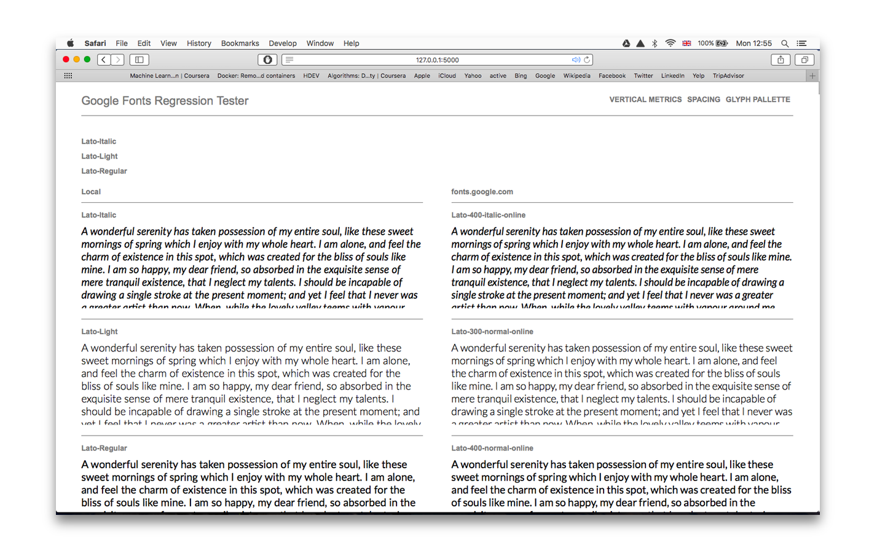

# Google Fonts Regression Tester

Compare local font families against the lastest release hosted on fonts.google.com.

# 

Keys Q,D will change between local and remote fonts.

**Warning: Error handling and better tests are needed. This webapp should not be treated as a God. It should be used in conjunction with good judgement.**

*"Measure twice, cut once" - English Proverb*

*"Measure seven times, cut once" - Russian Proverb*
